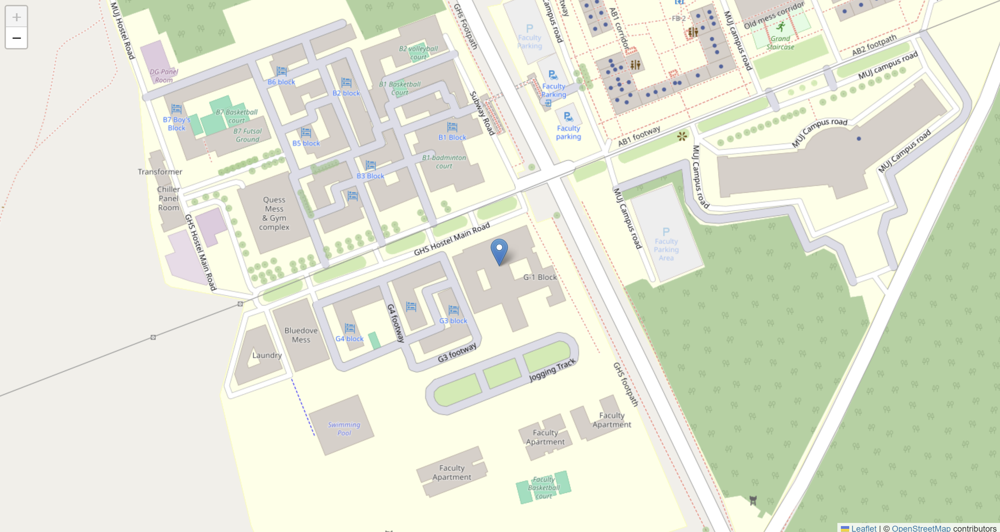

# RealTime-Tracker

RealTime-Tracker is a real-time location tracking application built with Node.js, Express, Socket.io, and Leaflet.js. It allows users to share their geolocation in real-time and visualize it on a map.

## Features

- Real-time location tracking using the Geolocation API
- Real-time updates of user locations on a map
- User disconnection handling
- Responsive design

## Technologies Used

- Node.js
- Express
- Socket.io
- Leaflet.js
- EJS (Embedded JavaScript templates)

## Installation

1. Clone the repository:
    ```sh
    git clone https://github.com/yourusername/realtime-tracker.git
    cd realtime-tracker
    ```

2. Install dependencies:
    ```sh
    npm install
    ```

3. Start the server:
    ```sh
    npm start
    ```

4. Open your browser and navigate to [`http://localhost:3000`](http://localhost:3000).

## Project Structure

- `app.js` - Main server file, sets up Express, Socket.io, and serves static files.
- `views/index.ejs` - Main HTML file rendered by the server.
- `public/css/style.css` - CSS styles for the application.
- `public/js/script.js` - Client-side JavaScript for map initialization and real-time location updates.
- `public/` - Contains static assets.

## Usage

1. Open the application in your browser.
2. Allow the browser to access your geolocation.
3. Your location will be tracked and displayed on the map in real-time.
4. If other users are connected, their locations will also be displayed on the map.

## License

This project is licensed under the ISC License. See the LICENSE file for details.

## Contributing

Contributions are welcome! Please open an issue or submit a pull request for any improvements or bug fixes.

## Acknowledgements

- [Express](https://expressjs.com/)
- [Socket.io](https://socket.io/)
- [Leaflet.js](https://leafletjs.com/)
- [OpenStreetMap](https://www.openstreetmap.org/)


